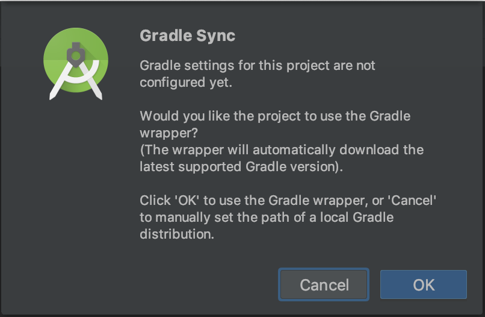
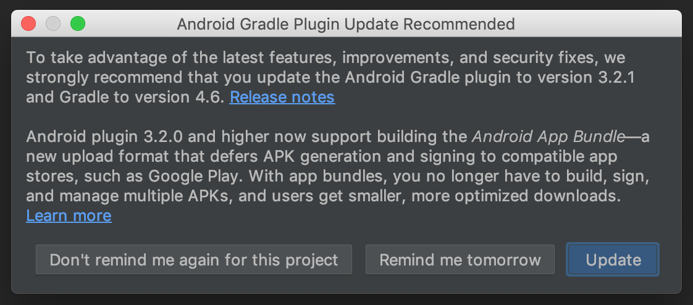
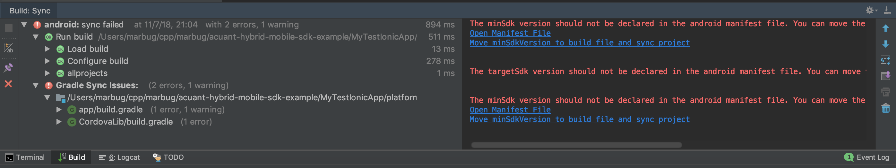

# Acuant Hybrid Mobile SDK example > Ionic3 App From Scratch > Run in Android Studio #

* Open **./MyTestIonicApp/platforms/android/** in **Android Studio**

* See

    

* Click **OK**

* See

    

* Click **Update**

* See

    

* Click **Move minSdkVersion to build file and sync project**
        
| Navigation |
| ---------- |
| [Up](../README.md) |
